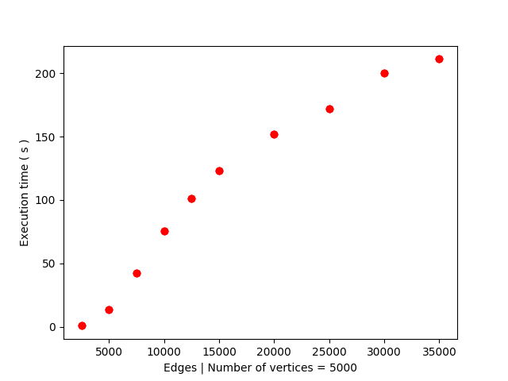

# Non uniform betweenness centrality
* Implementation of non-uniform betweenness centrality given non-uniform weights for vertex pairs ( prior ) for a simple graph ( directed/undirected, weighted/unweighted ).
* Assignment for the Complex Network Analysis course ( EE5154 ).

## Trial
To compile,
```
$ make
```
To run, execute
```
$ ./bin/main
```
and provide input in the appropriate format ( refer tests/\*.txt ).

For a sample run,
```
$ ./bin/main < tests/1.txt
```

## Structure
* graph-generator.py - Utility script to generate random graphs given (V, E).
* plot.py            - Utility script to plot Execution time Vs Number of vertices using test-logs.
* src/\*.cpp               - C++ implementation of the algorithm.

## Tests
To run tests for small graphs,
```
$ ./tests/test-small.sh
```
To run tests for large graphs,
```
$ ./tests/test-large.sh
```
To run tests for graphs with varied number of edges ( for a fixed number of vertices ).
```
$ ./tests/test-different-edges.sh
```

## Plots
* Variation of execution time with number of vertices ( ~ parabolic )


* Variation of execution time with number of edges, for a fixed number of vertices ( ~ linear )




## References
* [A Faster Algorithm for Betweenness Centrality - Algorithmics](http://www.algo.uni-konstanz.de/publications/b-fabc-01.pdf)
* [Betweenness centrality - Wikipedia](https://en.wikipedia.org/wiki/Betweenness_centrality)
* Networks: An Introduction, M. E. J. Newman, Oxford University Press, 2010
